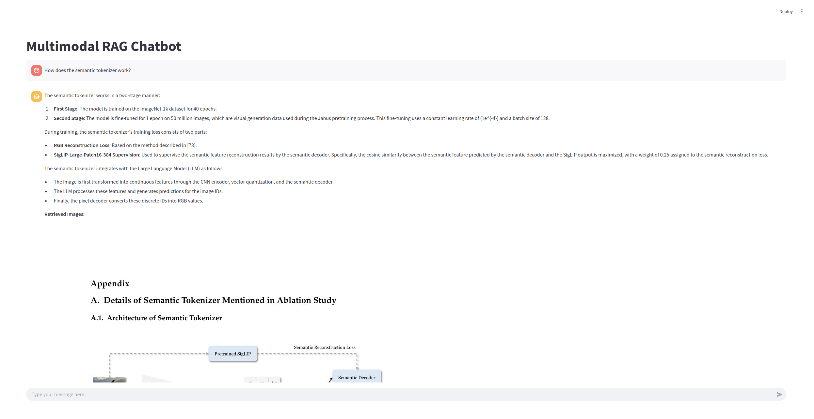
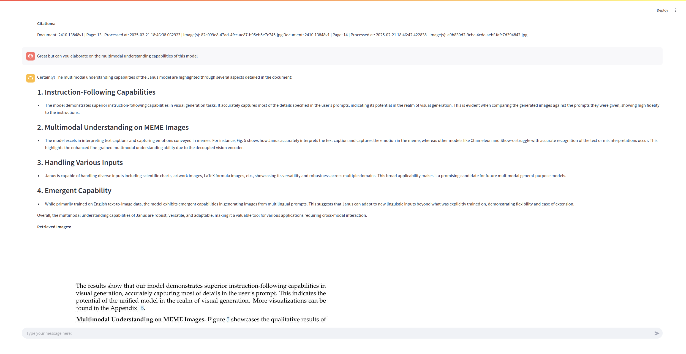
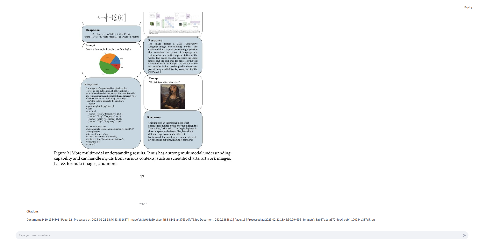

# 🚀 Multimodal RAG Pipeline

## 🔗 Components
- **VLM:** [Qwen2.5-7B-AWQ](https://huggingface.co/Qwen/Qwen2.5-7B-AWQ)
- **Embedder:** [gme-Qwen2-VL-2B-Instruct](https://huggingface.co/Qwen/gme-Qwen2-VL-2B-Instruct)
- **Database:** [ChromaDB](https://github.com/chroma-core/chroma)

---

## 🛠️ How to Use

### 1️⃣ Create Vector Database
This step processes all PDFs in the working directory and creates the vector database.

```bash
python multimodal_rag.py
```

### 2️⃣ Launch Streamlit UI

Run this command to start the UI:

```bash
streamlit run rag_ui.py
```

### Streamlit UI






